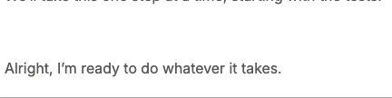

# React Medium Highlighter



A lightweight, Medium-like text highlighter for React. Highlight text, add comments, and rehydrate saved annotations.

---

## Features

- Highlight text with custom colors.
- Add comments or annotations.
- Save and rehydrate highlights.
- Easily copy selected text.

---

## Installation

Install the library using npm or yarn:

```bash
npm install react-highlighter
```

---

## Usage

```typescript
import React, { useState } from "react";
import { Highlighter } from "react-highlighter";

const App = () => {
const [annotations, setAnnotations] = useState([]);

const handleCreate = (annotation) => setAnnotations([...annotations, annotation]);
const handleRemove = (annotation) => setAnnotations(annotations.filter(a => a.text !== annotation.text));

return (
<Highlighter
      createAnnotation={handleCreate}
      removeAnnotation={handleRemove}
      annotations={annotations}
    />
);
};

export default App;
```

---

## Props

| Name             | Type     | Description                            |
| ---------------- | -------- | -------------------------------------- |
| createAnnotation | Function | Triggered when a highlight is created. |
| removeAnnotation | Function | Triggered when a highlight is removed. |
| annotations      | Array    | Pre-existing highlights.               |

---

## License

This project is licensed under the MIT License.
